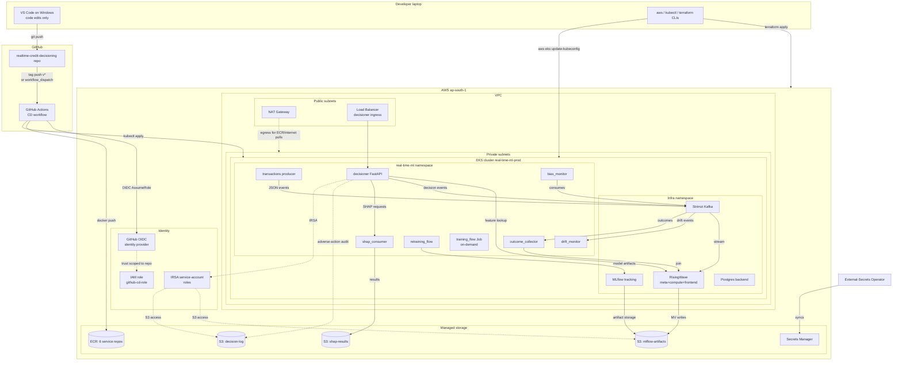

# AWS Deployment Guide

How the platform deploys to AWS EKS in `ap-south-1` (Mumbai). This
document captures both **the procedure** (what to run, in what order)
and **the rationale** (why each choice — every interview-relevant
decision is here).

For local kind deployment, see `docs/INFRASTRUCTURE.md`. For the
dev-vs-AWS split (which work happens where), see ADR 013.

---

## 1. What gets deployed on AWS

### Cloud-side (provisioned via Terraform — `infra/terraform/`)

| Resource | Module | Purpose |
|---|---|---|
| VPC + 2 public + 2 private subnets across 2 AZs | `modules/vpc` | Network plumbing. Private subnets host EKS nodes; public subnets host the NAT Gateway and Load Balancers. |
| 1 Internet Gateway + 1 NAT Gateway | `modules/vpc` | Egress for private-subnet workloads (pulls images from ECR + Docker Hub). |
| EKS cluster v1.30 + KMS encryption + OIDC provider | `modules/eks_cluster` | Managed Kubernetes control plane. |
| Managed node group: 5× m6i.large (min 3, max 8) | `modules/eks_cluster` | Worker nodes. 40 GB total RAM, 10 vCPUs — enough for all 11 services + Strimzi Kafka + RisingWave + MLflow + Postgres. |
| GPU node group: g5.xlarge (desired=0, max=2) | `modules/eks_cluster` | Scaled-to-zero by default. Scale up for GPU training only. |
| 6 ECR repositories (one per service) | `modules/ecr` | Container registry. Lifecycle: keep last 30 tagged, expire untagged after 7 days. |
| 3 S3 buckets (mlflow artifacts, decision log, shap results) | `modules/s3` | Object storage. Versioning + SSE encryption + lifecycle. |
| IAM IRSA mappings for 4 service accounts (decisioner, mlflow, shap-consumer, retraining-flow) | `modules/iam_irsa` | Pod-to-AWS auth without baking long-lived creds into pods. |
| GitHub OIDC IAM role (`github-cd-role`) | One-off AWS CLI (not yet in Terraform — see "Tech debt" §6) | Lets GitHub Actions assume an AWS role via OIDC, no static access keys in CI. |
| EKS addons: vpc-cni, kube-proxy, coredns, aws-ebs-csi-driver | `modules/eks_cluster` | Cluster networking + DNS + EBS volume support. |

### Cluster-side (deployed via Helm + kustomize, post Terraform)

| Layer | Component | How it's installed |
|---|---|---|
| Streaming | Strimzi Kafka operator + KafkaNodePool + Kafka CR | Helm + manifests (`install_kafka.sh` adapted for EKS). For prod, RF=3 via `deployments/overlays/aws-eks/kafka-prod-rf3.yaml`. |
| Streaming SQL / feature store | RisingWave (meta + compute + frontend + compactor + Postgres backend) | Helm (`risingwavelabs/risingwave`). MinIO → S3 swap via overlay config. |
| Model registry | MLflow tracking server + Postgres backend | Custom manifest (`deployments/dev/kind/manifests/mlflow-final.yaml`) with S3 artifact storage (ADR 005). |
| Application | All 11 services via base + overlay | `kubectl apply -k deployments/overlays/aws-eks/` |
| Secrets | External Secrets Operator + AWS Secrets Manager backend | `deployments/base/external-secrets/` + `overlays/aws-eks/external-secrets-store.yaml` |

---

## 2. Architecture diagram (AWS-deployed view)



### Cost-driving components

```
┌─────────────────────────────────┬──────────────┐
│ Resource                        │ Cost/day     │
├─────────────────────────────────┼──────────────┤
│ EKS control plane (flat)        │ $2.40        │
│ 5× m6i.large EC2 worker nodes   │ $11.71       │
│ NAT Gateway (data + hours)      │ $1.10        │
│ EBS volumes (5× 20 GB gp3)      │ $0.33        │
│ S3 (empty)                      │ ~$0.00       │
│ ECR (empty)                     │ ~$0.00       │
│ KMS keys (1 cluster + N grants) │ $0.03        │
│ Data transfer (estimate)        │ $0.50        │
├─────────────────────────────────┼──────────────┤
│ TOTAL DAILY                     │ ~$16.07      │
└─────────────────────────────────┴──────────────┘
```

If forgotten and left running:
- 1 week: $112
- 1 month: $482

**Tear-down sequence is `terraform destroy` — takes ~15 min.** No
billing alarm is configured today (user opted out); `terraform destroy`
is the sole safety net.

---

## 3. Deployment procedure (start to finish)

### 3.1 Prerequisites

On the Windows host (not in a devcontainer — Docker isn't required after
the OIDC path is set up, since GitHub Actions builds images):

| Tool | Version verified |
|---|---|
| AWS CLI | 2.32.20+ |
| Terraform | 1.15.5+ |
| kubectl | 1.32.2+ |
| git | 2.49.0+ |

```powershell
aws sts get-caller-identity  # confirms IAM identity + region
aws configure get region     # must equal ap-south-1
terraform --version
kubectl version --client
```

### 3.2 Provision cloud infrastructure (Terraform — ~25-30 min)

```powershell
cd C:\Users\abhin\realtime-credit-decisioning\infra\terraform
terraform init
terraform plan -out=tfplan
# Review what will be created. Expect "Plan: 101 to add, 0 to change, 0 to destroy."
terraform apply -auto-approve -input=false tfplan
```

The long step is the EKS control plane (~15-20 min). Once apply finishes:

```powershell
# Configure local kubeconfig
aws eks update-kubeconfig --name real-time-ml-prod --region ap-south-1

# Sanity check
kubectl get nodes
# Should show 5 nodes Ready
```

### 3.3 Set up GitHub Actions OIDC (one-off — already done for this account)

Records the IAM role that GitHub Actions assumes for ECR push + EKS deploy.
**This was done via the AWS CLI** (`aws iam create-open-id-connect-provider`
+ `aws iam create-role` with trust policy scoped to the repo).
Codifying in Terraform is on the tech-debt list.

Output: GitHub repo secret `AWS_CD_ROLE_ARN` =
`arn:aws:iam::998716768706:role/github-cd-role`.

### 3.4 Build + push container images (GitHub Actions — ~15-20 min)

The CD workflow (`.github/workflows/cd.yml`) builds 7 service images and
pushes them to ECR. Fires on:
- Tag push matching `v*`
- (After follow-up edit) `workflow_dispatch` for manual triggering

Trigger via either:
```powershell
# Option A: push a tag (pre-release works for testing)
git tag v1.1.0-rc1
git push origin v1.1.0-rc1
```
or via the GitHub UI: Actions tab → cd workflow → "Run workflow" button
(requires `workflow_dispatch:` trigger in the YAML).

### 3.5 Install streaming infra (Helm — ~10-15 min)

These three components are not part of the Terraform apply; they install
via Helm into the EKS cluster:

```powershell
# Strimzi Kafka operator + Kafka cluster
kubectl create namespace kafka
kubectl apply --server-side -f 'https://strimzi.io/install/latest?namespace=kafka' -n kafka
kubectl apply -f C:\Users\abhin\realtime-credit-decisioning\deployments\dev\kind\manifests\kafka-e11b.yaml
# For prod RF=3, use overlays\aws-eks\kafka-prod-rf3.yaml instead.

# RisingWave
helm repo add risingwavelabs https://risingwavelabs.github.io/helm-charts/ --force-update
helm repo update
helm upgrade --install --create-namespace --wait risingwave risingwavelabs/risingwave `
  -n risingwave -f C:\Users\abhin\realtime-credit-decisioning\deployments\dev\kind\manifests\risingwave-values.yaml

# MLflow (uses S3 artifact store, not MinIO, on AWS)
kubectl create namespace mlflow
# Use the AWS overlay to inject IRSA service account
kubectl apply -k C:\Users\abhin\realtime-credit-decisioning\deployments\overlays\aws-eks\
```

### 3.6 Apply RW DDL (~5 min)

```powershell
# Port-forward to the EKS-hosted RW
kubectl -n risingwave port-forward svc/risingwave 4567:4567 &
# Apply all DDL
bash deployments/dev/risingwave/apply_ddl.sh
```

### 3.7 Run training pipeline (~25-35 min)

```powershell
# Submit training as a K8s Job
kubectl apply -f deployments\base\services-finance\transactions\backfill-job.yaml
# Watch progress
kubectl -n real-time-ml logs -f jobs/transactions-backfill
# After backfill, run training_flow as a Job
# (similar pattern; not yet templated as a manifest)
```

### 3.8 Tag + tear down

```powershell
# Tag the validated version
git tag v1.1.0
git push origin v1.1.0

# Tear down EKS to stop the meter
cd infra\terraform
terraform destroy -auto-approve
```

---

## 4. Why these choices (rationale)

### 4.1 Why EKS managed control plane (not self-managed K8s on EC2)

- EKS control plane is **$0.10/hr regardless of cluster size**. Cheap
  insurance against control-plane misconfiguration / etcd corruption /
  upgrade headaches.
- Self-managed K8s requires 3 dedicated EC2 instances for control plane
  (etcd quorum), at $20-40/day for high availability. Total cost is
  higher despite "no managed fee".
- Operational burden of self-managed control plane is the dominant cost.

### 4.2 Why managed node groups (not Karpenter or self-managed ASG)

- Managed node groups support EKS-native lifecycle handling: graceful
  drain, replace, upgrade via the EKS API.
- Karpenter is the modern choice (faster, denser packing, no node-group
  taints), but adds installation complexity. For a 1-day dev cluster, the
  managed group is fine.
- **Production prod migration**: move to Karpenter for ~20-30% node-cost
  savings via fast scale-down + spot mixing.

### 4.3 Why 5× m6i.large for the node group (not 3 + autoscale, not GPU)

- 3× m6i.large is the bare minimum for the workload (24 GB total RAM
  vs ~20 GB demand at peak). Insufficient headroom for backfill + retrain
  bursts.
- 5× m6i.large gives 40 GB RAM and 10 vCPUs — comfortable headroom for
  all 11 services + infra + a peak-time training Job.
- `desired_size = 5` deploys 5 immediately. `min = 3, max = 8` lets the
  Cluster Autoscaler add 3 more if a future load spike triggers
  Pending pods, then scale back down.
- No need for GPU today: T-learner training is small enough for CPU.
  GPU node group exists at `desired = 0` for future use (Bayesian PD
  on PyMC, deep RL ladder, large XGBoost training).

### 4.4 Why GitHub OIDC (not static access keys)

- Static keys in GitHub secrets are a credential rotation problem and
  a primary leak source.
- OIDC trust binds the role assumption to a specific repo + workflow.
  Even if your GitHub PAT leaks, an attacker still can't assume the role
  outside the repo context.
- Industry standard. JPM, Capital One, Stripe all use this pattern.
- Setup cost: one-time IAM identity provider + role + trust policy.
  Codify in Terraform when ready (tech debt).

### 4.5 Why we self-host MLflow and RisingWave on EKS (not SageMaker Feature Store)

- **RisingWave**: AWS has no managed equivalent. Kinesis Data Analytics
  is batch-y SQL, not streaming materialized views. Materialize is a
  SaaS competitor but separate ops surface.
- **MLflow**: portable across clouds; SageMaker Model Registry is
  AWS-only. Most fintech teams keep MLflow even when otherwise
  AWS-heavy.
- **SageMaker Feature Store** would be added as a sibling for *offline*
  batch features (point-in-time joins on historical data). It does NOT
  replace RisingWave's sub-second online MVs. We don't have a need today
  but would add it for the training-from-batch path (Phase I.2C
  follow-up).

### 4.6 Why local Terraform state for today (not S3 backend)

- Terraform code (`main.tf`) references an S3 bucket `rtcd-terraform-state`
  for state, but that bucket doesn't exist yet.
- For a 1-day dev cluster, local state is fine: cluster is torn down
  end of day, state file evaporates with it.
- **Production migration**: create the S3 state bucket manually with
  versioning + encryption + lock via DynamoDB, then uncomment the
  backend block in `main.tf`. ~15 min one-off work.

### 4.7 Why AdministratorAccess on the github-cd-role (today)

- Tech debt. The "right" approach is least-privilege: an IAM policy
  scoped to specific ECR repos + EKS cluster + S3 buckets.
- For 1-day dev, AdministratorAccess gets us to v1.1.0 validated faster.
- The mitigating control: trust policy scopes assumption to the specific
  repo. Even with admin, only the CD workflow in this repo can use it.
- **Follow-up**: replace with `ecr:Put*`, `ecr:Get*`, `ecr:Batch*`,
  `eks:Describe*`, `eks:List*` only. ~30 min work.

### 4.8 Why ap-south-1

- User context: India/Dubai role positioning. AWS Mumbai is the most
  cost-efficient choice for Indian customers and the lowest-latency
  region for that market.
- Data residency: ap-south-1 keeps data inside Indian jurisdiction
  (RBI / SEBI compliance for fintech work).
- ~5-10% cheaper than us-east-1 for the EC2 family used here.

---

## 5. Cleanup procedure

```powershell
cd C:\Users\abhin\realtime-credit-decisioning\infra\terraform

# Destroy in reverse-dependency order (Terraform handles this automatically)
terraform destroy -auto-approve

# Verify nothing remains
aws eks list-clusters --region ap-south-1
aws ecr describe-repositories --region ap-south-1
aws s3 ls
# All should return empty or only resources from other projects
```

**Cleanup is NOT optional.** $16/day adds up fast. Tear down at end of
each working session.

---

## 6. Tech debt items (deliberately deferred today)

| Item | Why deferred | Estimated effort |
|---|---|---|
| Codify OIDC role + provider in Terraform | Today's apply was already running; would have required a second apply | 1 hour |
| Replace AdministratorAccess with least-privilege policy | Speed; one-day cluster | 30 min |
| Create S3 backend for Terraform state | One-day cluster | 15 min |
| Add `workflow_dispatch:` trigger to `cd.yml` | Was easier to skip and use tag-push for this session | 5 min |
| Add `bias_monitor` to cd.yml service matrix (currently 6 services, should be 7) | Not blocking v1.1.0 | 2 min |
| Move EKS cluster name from `real-time-ml-prod` to `rtcd-dev` for honest naming | Would have required cd.yml env-var changes | 10 min |
| Replace bundled Postgres (RW chart) with RDS Postgres | Production hardening | 4 hours (Terraform module + migration) |
| Replace bundled MinIO (RW chart) with S3 for RW's own storage | Production hardening | 2 hours (RW helm values change) |
| Set up CloudWatch Container Insights for EKS observability | Out of scope today | 1 hour |
| Set up VPC Flow Logs + GuardDuty | Security hardening | 30 min each |
| Use Spot instances for non-prod node groups | Cost optimization | 30 min |
| Migrate to Karpenter from managed node groups | Future production | 1 day |

---

## 7. Known issues + workarounds

### 7.1 Local Docker not required after OIDC setup

The original Day-7 procedure assumed local Docker was available for
image builds. **It isn't required** if you offload builds to GitHub
Actions via the CD workflow. Doing so:
- Reduces local disk pressure (no kind cluster + image cache needed)
- Aligns with the "code locally, infra in cloud" senior-engineer pattern
- Slightly slower iteration (push branch → wait for CI vs. local build)

### 7.2 The aws-eks overlay does NOT install Strimzi / RW / MLflow

The overlay only deploys the *application* services (decisioner,
drift_monitor, etc.). Infrastructure (Strimzi Kafka, RisingWave, MLflow)
installs separately via Helm + manifests (see §3.5). This is by design:
operators (Strimzi, RW) are not idiomatic Kustomize resources.

### 7.3 GPU node group is at desired=0 by default

Training runs on CPU. If you need GPU (e.g., for Bayesian PD via PyMC
with NUTS sampler, or deep RL), scale the GPU node group up:

```powershell
aws eks update-nodegroup-config --cluster-name real-time-ml-prod `
  --nodegroup-name gpu --scaling-config "desiredSize=1,minSize=0,maxSize=2"
```

g5.xlarge costs ~$3.20/hr in ap-south-1 — scale back to 0 when done.

---

## 8. References

- ADR 005: MLflow `--serve-artifacts` proxy mode
- ADR 006: Kustomize base + overlays
- ADR 008: Python FastAPI decisioner (supersedes Rust)
- ADR 013: Dev-vs-AWS validation split (this session's decision)
- `docs/INFRASTRUCTURE.md`: Local kind deployment reference + fix log
- `docs/architecture_diagrams.md`: System-wide architecture diagrams
- `docs/scope_expansion_plan.md`: Roadmap including Phase G
  (External Secrets) and Phase I (Kafka RF=3, FinOps tagging)
