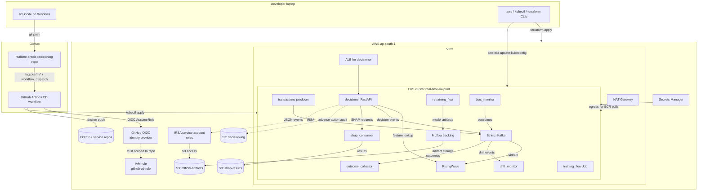

# Architecture Diagrams

Canonical diagrams for the system. Reference these from chapter docs
rather than duplicating ASCII inline; that way a change to the diagram
updates everywhere.

## D1 — Four-plane overview

See `docs/05_architecture.md` for the source-of-truth version. The
diagram below is a copy maintained in sync.

```
┌──────────────────────────────────────────────────────────────────────┐
│  STREAMING PLANE                                                     │
│                                                                       │
│  transactions ──► Kafka ──► behavioral_features ──► RisingWave (MV)  │
│  news ──► Kafka ──► news-sentiment ──► Kafka ──► RisingWave (joined) │
│  outcomes ──► Kafka ──► outcome_collector ──► RisingWave             │
│  decisions ──► Kafka ──► drift_monitor ──► drift_events Kafka topic  │
└──────────────────────────────────────────────────────────────────────┘
                                  ▲                       │ drift event
                                  │                       ▼
┌─────────────────────────────────┴────┐    ┌────────────────────────┐
│  SYNCHRONOUS DECISION PLANE          │    │  BATCH PLANE (Metaflow)│
│  decisioner (Rust; ADR 004)          │    │  retraining_flow       │
│   1. RisingWave Postgres lookup      │    │   - foreach segment    │
│   2. Segment route                   │    │   - train T-learner    │
│   3. ONNX uplift inference           │    │   - export ONNX        │
│   4. Bandit select action            │    │   - register MLflow    │
│   5. Audit log enqueue ──► Kafka ────┘    │   - promotion gate    │
│   6. HTTP response                          └──────────┬─────────────┘
└─────────────────────────────────────┘                  │
                                                          │
                                            ┌─────────────▼──────────┐
                                            │  MODEL REGISTRY PLANE  │
                                            │  MLflow + MinIO/S3     │
                                            │  (proxied per ADR 005) │
                                            └────────────────────────┘
```

## D2 — Single decision call graph

```
POST /decide { customer_id, event }
   │
   ├─► sqlx::query(feature_view) ──► RisingWave Postgres protocol  ~5 ms
   ├─► segment_router::route(features)                              < 1 ms
   ├─► onnx_session.run(features)                                   5–10 ms
   ├─► bandit::select(uplift_estimates, costs, regulatory)          < 1 ms
   ├─► audit_log_queue.send_nowait(decision)                        < 1 ms
   └─► HTTP 200 with action + decision_id                            ~2 ms
                                                          ────────────
                                                          p99 target < 50 ms
```

## D3 — Drift-triggered retraining loop

```
behavioral_features stream  ──┐
                              ├─► drift_monitor ─► PSI / KS / ADWIN
decisions stream    ──────────┘                    │
                                                   ▼ if threshold exceeded
                                          drift_events Kafka topic
                                                   │
                                                   ▼
                                          Argo Events Sensor (K8s)
                                                   │
                                                   ▼
                                          retraining_flow.run()
                                                   │
                                          ┌────────┼────────┐
                                          ▼        ▼        ▼
                                       segA      segB      segC   (Metaflow foreach)
                                          │        │        │
                                          └────────┼────────┘
                                                   ▼
                                          validation gate
                                          (offline metric + per-segment
                                           no-regression + calibration)
                                                   │
                                  ┌────────────────┼────────────────┐
                                  ▼ pass                            ▼ fail
                          register as challenger in MLflow      archive
                                  │
                                  ▼
                          shadow score (1 hour)
                                  │
                                  ▼
                          off-policy eval (IPS/SNIPS/DR)
                                  │
                          ┌───────┴───────┐
                          ▼ +lift         ▼ no lift
                  canary 5%/25%/100%   archive
                          │
                          ▼
                  4-eyes alias swap in MLflow
                  (champion := challenger)
```

## D4 — Cloud-agnostic substrate + AWS overlay

```
                      ┌─────────────────────────────────┐
                      │   deployments/base/             │
                      │   (cloud-agnostic K8s YAML)     │
                      └────────────┬────────────────────┘
                                   │
                ┌──────────────────┼──────────────────┐
                ▼                  ▼                  ▼
   ┌────────────────────┐ ┌──────────────────┐ ┌──────────────────┐
   │ overlays/          │ │ overlays/        │ │ overlays/        │
   │  local-kind/       │ │  aws-eks/        │ │  on-prem/        │
   │                    │ │                  │ │                  │
   │ local registry     │ │ ECR images       │ │ Harbor images    │
   │ MinIO              │ │ S3 + IRSA        │ │ Ceph + ESO+Vault │
   │ bundled Postgres   │ │ RDS              │ │ in-house PG      │
   │ kind storage class │ │ gp3 storage      │ │ internal CSI     │
   │ nginx ingress      │ │ ALB controller   │ │ MetalLB / NGINX  │
   └────────────────────┘ └──────────────────┘ └──────────────────┘
```

## D5 — Cross-plane invariants (what's allowed, what's not)

```
Allowed cross-plane communications:
  Kafka topic              ──►  ✓ append-only event
  MLflow registry alias    ──►  ✓ versioned artifact
  RisingWave MV read       ──►  ✓ shared data plane

Forbidden cross-plane communications:
  Direct HTTP call         ──►  ✗ couples deploys
  Shared mutable state     ──►  ✗ couples failure
  Direct file write        ──►  ✗ bypasses registry
```

## D6 — AWS deployment (post-ADR-013)

How the system lays out when deployed on AWS EKS in `ap-south-1`.
Added 2026-06-30 alongside ADR 013. See `docs/AWS_DEPLOYMENT.md` for the
full procedure + rationale.



### Plane-by-plane mapping (kind → AWS)

```
Streaming plane:
  kind:  Strimzi Kafka on local volumes
   AWS:  Strimzi Kafka on EKS, EBS gp3 volumes
   prod: MSK (managed) — config-only change in producers/consumers

Feature store / streaming SQL:
  kind:  RisingWave with bundled MinIO
   AWS:  RisingWave with S3 object store (chart values override)
   prod: Same — no managed equivalent for streaming MVs

Model registry:
  kind:  MLflow with --serve-artifacts → bundled MinIO
   AWS:  MLflow with --serve-artifacts → S3 (IRSA-attached SA)
   prod: Same

Decisioner:
  kind:  FastAPI pod, ClusterIP service
   AWS:  FastAPI pod, ALB ingress, IRSA for SHAP audit S3
   prod: Same architecture; consider SageMaker Endpoint for vanilla
         segments later

Secrets:
  kind:  K8s Secrets from .env.local
   AWS:  AWS Secrets Manager → External Secrets Operator → K8s Secrets
   prod: Same; rotation via AWS Secrets Manager lambda
```

### Cost cross-section (5-node dev EKS, daily)

```
EKS control plane             $2.40 (flat)
5× m6i.large worker nodes     $11.71
NAT Gateway                   $1.10
EBS volumes (5× 20 GB gp3)    $0.33
KMS keys                      $0.03
Data transfer / S3 / ECR      $0.50
────────────────────────────────────
TOTAL                        ~$16/day
```

Tear down via `terraform destroy` at end of session.

## Status

Diagrams stable through Day 0; D6 added 2026-06-30 (ADR 013).
They are updated only when an ADR changes the architecture;
mid-build implementation details do not modify these.
